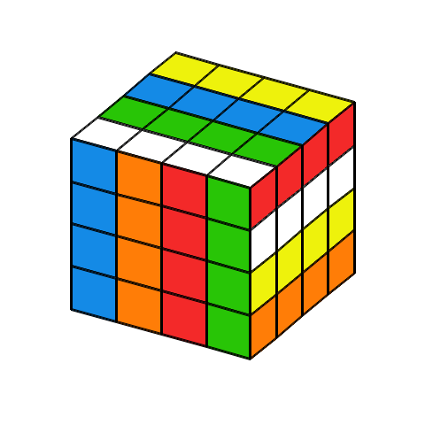

# CubImg

[CubImg](https://github.com/wklchris/cubimg) is an image tool for magic cube visualization.

<p align="center">
  
</p>

*The above image is generated with following CubImg command*:

`cubimg --order 4 "F R2 3Dw' D R2 B 3Dw D' R D2 B 3Rw R' 3Dw' D F' R2 U' B2 Uw2 Rw2 U2 R2 Fw2 Rw2 2Uw2 U2" -f cubimg_illust.png --width 480 --height 480`

Table of contents:
- [Website Example](#website-example)
- [Installation](#installation)
- [Build and Libraries Used](#build-and-libraries-used)
- [LICENSE](#license)


## Website Example

HTML examples with cube images are generated by (compiled executable of) the `docs/doc.cpp` file. You can browse the example website at:

- **CubImg illustration website (CFOP images)**: [https://wklchris.github.io/cubimg/](https://wklchris.github.io/cubimg/)

## Installation

CubImg relies on drawing backends to draw cube images. The primary backend is [Gnuplot](http://www.gnuplot.info).

To use CubImg, users need to:

1. Download and install a supported backend. Adding it to PATH environment is also recommended.
2. Download the CubImg binary executable from the Release page of this repository. For developers, they might also be interested in [building the project](#build-and-libraries-used).
3. Follow the command line help (`cubimg --help`) or the project documentation to use CubImg. 

Here is a snapshot of help message of CubImg v0.3:

```
cubimg.exe [OPTIONS] [algo]


POSITIONALS:
algo TEXT                   Space-separated algorithm to apply to the cube. Example: "R U R'
                            U'"

OPTIONS:
-h,     --help              Print this help message and exit
        --engine, --engine-path TEXT [gnuplot]
                            Executable path of the engine. If the engine has been added to
                            the PATH environment, you can use the engine name instead of full
                            path. Example: "C:/gnuplot/gnuplot.exe"
-R,     --reverse-alg       Execute the algorithm steps in reverse. Example: R U -> U' R'
-f,     --file TEXT         Output file path. If empty, print the cube (in expanded view) to
                            screen instead. Allowed format: pdf, png, svg, tex, tikz
-o,     --order INT:INT in [2 - 7] [3]
                            The order of cube (cube size), range in 2 ~ 7
-I,     --color-UFR, --color-init TEXT [white,green,red]
                            Comma-separated color names on faces U, F, and R. Useful for
                            cubers who don't use yellow-cross. Allowed names: yellow, white,
                            red, orange, green, blue.
-W,     --width INT:POSITIVE [400]
                            Image width in pixels (for png/svg only)
-H,     --height INT:POSITIVE [400]
                            Image height in pixels (for png/svg only). Set to the same as
                            width if not given.
-E,     --elevation INT:INT in [0 - 90] [60]
                            View elevation angle (0-90)
-A,     --azimuth INT:INT in [90 - 180] [120]
                            View azimuth angle (90-180)
        --reflection TEXT   Cube faces to draw in reflected view. Can only contains
                            upper-/lower-case letter: B, D, and L.
-L,     --linewidth FLOAT:POSITIVE [3]
                            Line width for drawing
-s,     --algo-set TEXT     Batch drawing a pre-defined set of algorithms. Allowed sets: pll,
                            oll, f2l
-k,     --keep-script       Keep the intermediate drawing script file. By default it will be
                            deleted after execution.
-V,     --version           Show version information
```

## Build and Libraries Used

For users who would like to compile the CubImg project, they need to configure the following libraries on your device. Many thanks to these libraries:

* [CLIUtils/CLI11](https://github.com/CLIUtils/CLI11): For command line argument processing ([license](./LICENSE_CLI11)).

It is recommended to build the project with CMake:

```
cmake -S . -B build -DCMAKE_BUILD_TYPE=Release
cmake --build build
```

CubImg's executable would be generated under the folder `build/src`. Run it with:

```
./build/src/cubimg
```

## LICENSE

[MIT](./LICENSE)
